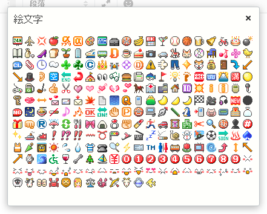

#EmojiForTinyMCE

Movable Type 6 で使用されているリッチエディタ TinyMCE 用の絵文字プラグインです。
Six Apart 絵文字を使えるようにします。

インストールするとスマイルマークのボタンがリッチエディタの 2 段目右側に追加されます。

このボタンをクリックすると絵文字一覧が表示されますので、使いたい絵文字をクリックしてください。

#インストール
mt-static と plugins を、MT のインストールディレクトリにアップロードしてください。

